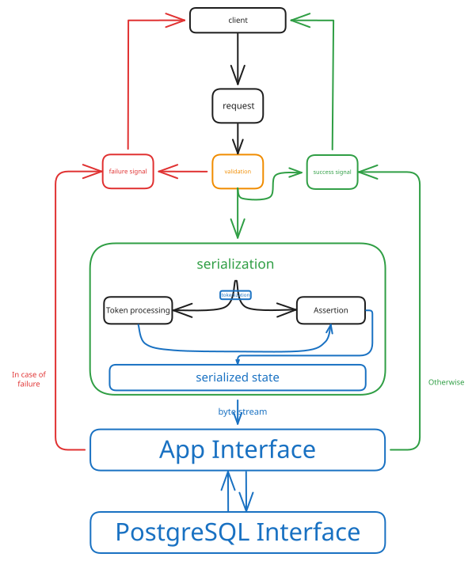

  

<h1 align="center">pg-serve</h1>

Crypto-security focused Python REST interface for PostgreSQL

---

## Features
- KEK derivation from passwords
- DEK envelope wrapping
- Per-column data encryption envelope
- Session management

## Goal
This project is a proof-of-concept to learn how servers, databases, and secure pipelines really work.
It’s a work in progress - code is not finished yet, but I’m constantly developing and improving it.

Goal: finish baseline development by June.

## Licence
This project is licenced under the [MIT license](LICENSE).

---

---

    

